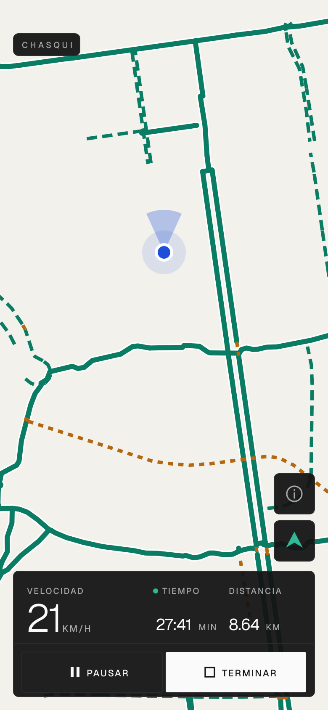

# chasqui

Mapa de ciclovías del Perú para Android. Te muestra dónde están las vías ciclistas, dónde estás vos,
hacia dónde mirás, a cuánto vas y cuánto llevás recorrido.

Los chasquis llevaban mensajes corriendo por la red de caminos incas. Esta app hace lo mismo con la
red de ciclovías: te dice por dónde se puede.

**Anda en cualquier Android, con servicios de Google o sin ellos.** La ubicación sale del proveedor
del sistema, no del de Google.

<p align="center">
  
</p>

## Qué hace

- La red ciclista del Perú entera, **2320 tramos**, en tres trazos: vía propia continua, carril
  pintado punteado, compartida con autos en ámbar.
- Dónde estás, con el círculo de precisión del GPS y un cono que sigue la brújula. Pedaleando, la
  brújula aprende sola cuánto se desvía comparándose con el rumbo del GPS.
- Un botón que hace que el mapa te siga y gire hacia donde mirás.
- Velocímetro en km/h.
- Recorridos: empezás, pedaleás, terminás, y te da distancia, tiempo y media.
- La pantalla no se apaga, porque el teléfono va en el manubrio.

## Qué no hace, a propósito

- **No tiene servidor.** La red viaja dentro del APK: son 66 KB comprimidos. Nada que se caiga, nada
  que pagar.
- **No mide con la pantalla apagada.** La ubicación de MapLibre es de primer plano; si salís de la
  app, la distancia deja de sumar. Hacerlo bien necesita el permiso de ubicación «todo el tiempo».
- No guarda los recorridos: el resumen se ve una vez y se va.
- No calcula rutas de A a B. Eso necesita un motor de ruteo, y eso necesita servidor.
- No busca lugares por nombre. No tiene cuentas. No corre en iOS.

El mapa de fondo sí necesita señal. Las ciclovías no: ya están en el teléfono.

## Correrlo

Hace falta [Bun](https://bun.sh) y el SDK de Android.

```sh
bun install
bun run prebuild     # genera android/, una sola vez
bun run android      # build de desarrollo, con Metro
bun run check        # lint y tipos, antes de subir nada
```

El APK que se instala y anda solo sale fechado en `build/`:

```sh
bun run apk
adb install -r build/chasqui-1.0.0-*.apk
```

Si `prebuild` dice que `@maplibre/maplibre-react-native` no tiene un config plugin válido, faltan
las dependencias: corré `bun install`.

## Los datos

`assets/cycleways.json` es una foto de OpenStreetMap, sacada del extracto de Perú de Geofabrik y
clasificada en tres tipos, con las coordenadas redondeadas a un metro.

Actualizarla es reemplazar ese archivo y compilar de nuevo. No hay otra forma, y es el precio de no
tener servidor.

Datos de OpenStreetMap y sus colaboradores, bajo [ODbL](https://opendatacommons.org/licenses/odbl/).

## Diseño

Bun · Expo Router · MapLibre Native · NativeWind sobre Tailwind · Geist · Feather · Biome. Sin
backend, sin base de datos, sin cliente HTTP, sin librería de estado.

Toma el lenguaje de [lagartosoft.org](https://lagartosoft.org): **Geist**, superficies monocromas,
bordes de un píxel, esquinas de 2 a 6. Nada de sombras ni de pastillas redondeadas.

**El verde se gasta en tres sitios y en ninguno más**: la red ciclista, la acción principal y el
mando activo. Todo lo demás es gris. Si el verde se repartiera por la interfaz dejaría de significar
«ciclovía», que es el trabajo que tiene que hacer en un mapa que se mira un segundo. Los valores
viven en `lib/theme.ts` y `lib/map.ts` porque MapLibre necesita literales.

`docs/mockup.png` se dibuja desde el repo: los trazos son los tramos reales de San Borja que hay en
`assets/cycleways.json`, y los colores, grosores y tamaños salen de `lib/theme.ts` y `lib/map.ts`.
Si el diseño cambia, la imagen queda vieja y hay que rehacerla.

El icono es una **greca escalonada** andina, que además se lee como un camino subiendo terrazas. La
fuente es `assets/icon.svg` y los PNG se regeneran desde ahí; el comando está dentro del SVG. Todo
el trazo entra en el 61% central: Android recorta con una máscara circular y lo de fuera desaparece.

## Contribuir

[`AGENTS.md`](AGENTS.md) orienta a quien va a modificar la app, sea persona o agente. Las reglas
están en [`docs/conventions/`](docs/conventions/), una por tema.

## Pendiente

- Elegir licencia.
- **Offline del mapa de fondo.** Las ciclovías ya van dentro; las calles no. El estilo del mapa es
  una URL y podría ser un objeto en el código, para que sin señal se dibuje igual la red sobre un
  fondo liso.
- Firmar con un keystore propio. Hoy va con la clave de depuración de Expo: sirve para probarlo y
  para nada más, porque un APK firmado con otra clave no se instala encima del anterior.
